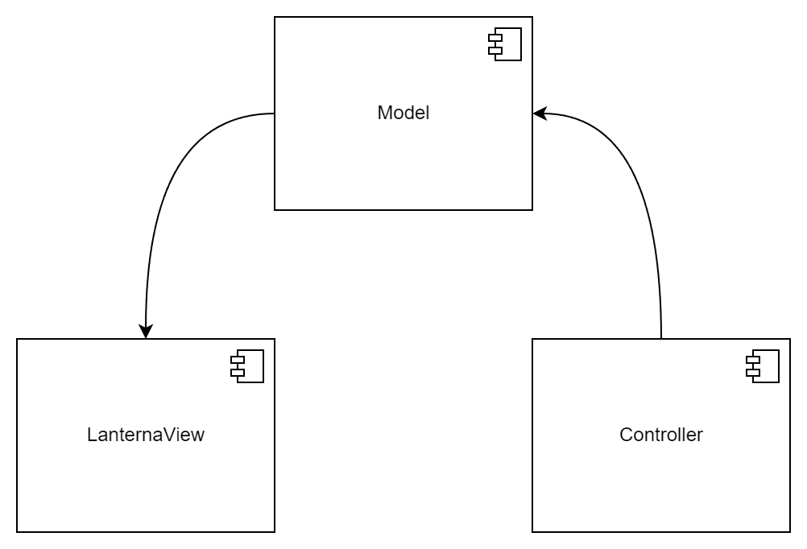
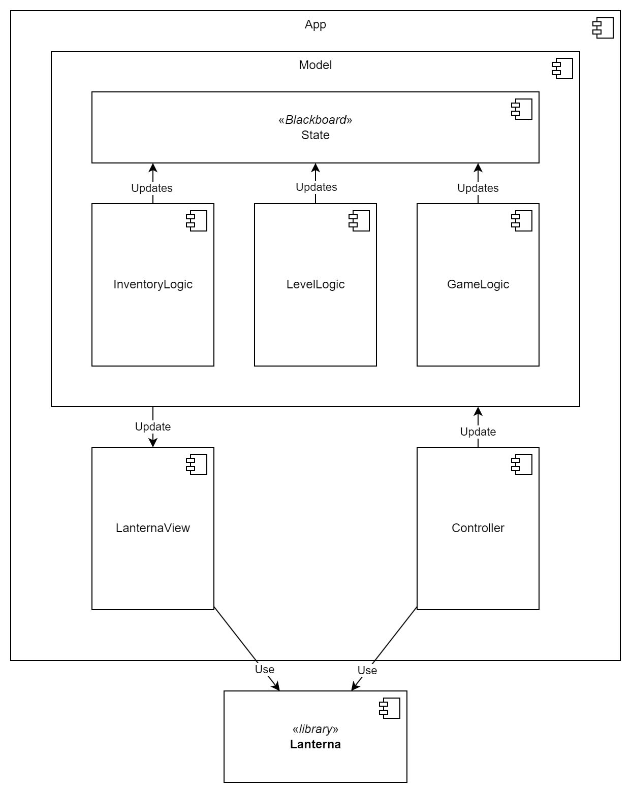
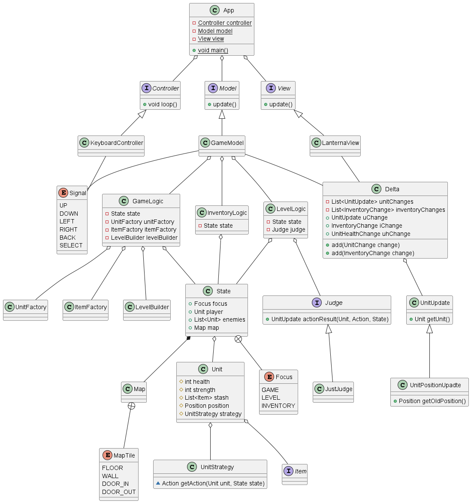
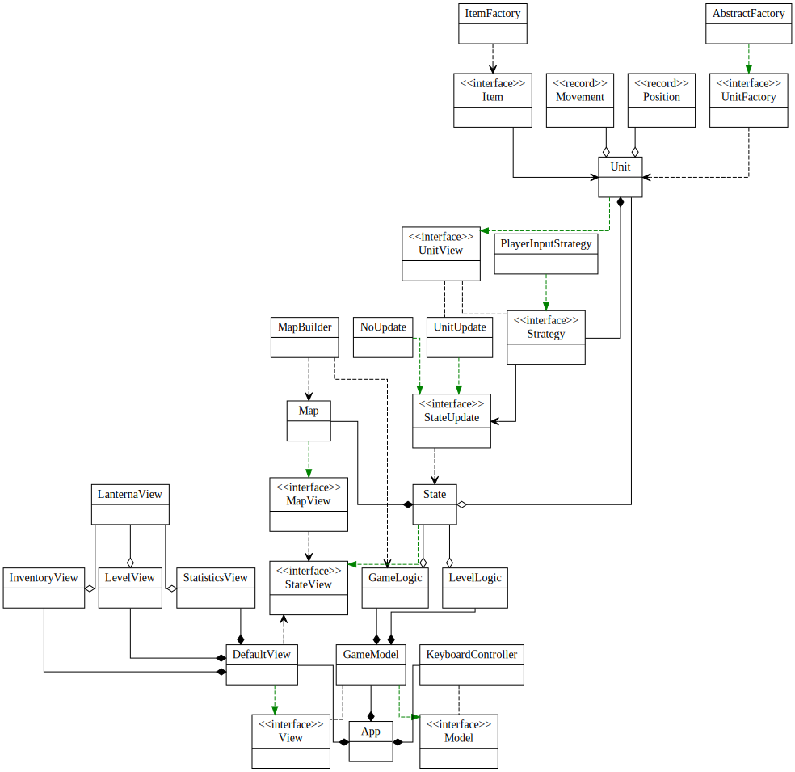

## Участники:
- Анеля Дусаева
- Артемий Лазарев
- Маргарита Лазарева
- Ильсияр Фаттахова

## Описание

Игра пошаговая, цель - пройти как можно больше комнат. Игрок находится только в одной комнате. Переход в следующую комнату осуществляется только после убийства всех врагов в текущей комнате. Вернуться в следующую комнату нельзя. Из одной комнаты может быть несколько выходов в другие комнаты, игрок может выбрать, в какую пойти. Одно перемещение игрока сопровождается одним перемещением монстров в комнате.

Предметы хранятся в инвентаре у любого юнита (игрока или противника). После смерти врага игрок может выбрать, что из имеющегося инвентарят врага он возьмёт себе.

Фокус игрока может переключаться с игрового поля на инвентарь. В зависимости от того, на чём сейчас находится фокус, состояние игры меняется по-разному: для игрового поля изменение состояния --- это результат передвижений и сражений, для инвентаря --- выбор предмета, который в данный момент находится на игроке.

Игра заканчивается, когда у игрока не остаётся здоровья.

## Управление и отображение
`@` - игрок, стены - белые, пол - чёрный. Выходы отмечены как клетки зелёного(обычная), красного (сложная комната) и жёлтого (сокровищница) цветов.
Цвет юнита указывает на его здоровье. Юниты также обладают различными иконками когда они живы и нет.

`ESC` - переключение фокуса между картой и инвентарём
 * Инвентарь
   * Стрелки вверх-вниз меняют выбранный предмет
   * `Enter` - применяет выбранный предмет
   * Применение `Poison`, которое всегда есть при игроке, убивает игрока и заканчивает игру
 * Карта
   * Стрелки двигают игрока по карте
   * Движение на живого противника спровоцирует атаку (но перемещения не произойдёт)
   * Движение на мёртвого противника добавит все его предметы в инвентарь
### Описание типичного пользователя

Человек, в возрасте от 18 до 40 лет, которому очень нравятся игры жанра Roguelike. Наш пользователь ценит простоту и классический ASCII-интерфейс с единым режимом и единым набором команд. 
Он предпочитает, чтобы сложность прохождения увеличивалась с повышением уровня, чтобы была свобода со множеством вариантов прохождения и при этом наличие "удачных" уровней", где можно перевести дух и собрать интересные артефакты.
Мы не ограничиваем нашего пользователя в выборе операционной системы, он считает кроссплатформенность ценным свойством приложения. 
Пользователь желает, чтобы каждое прохождение и каждый уровень были неповторимы, ему важен азарт и умение противников менять стратегии. 

#### Роли:
Игрок

#### Случаи использования:
Игрок может:
1. начать игру, запустив нужные команды
2. перемещаться по карте
3. следить за своей статистикой, текущим уровнем здоровья, силой, опыта, своим уровнем и номером комнаты, которую он проходит
4. атаковать мобов для получения опыта и артефактов
5. поднимать артефакты
6. применять артефакты - увеличивать свои показатели, наносить урон

## Основные сущности

Выбранная архитектурная модель --- MVC.

### Model

1. `Logic`: внутренняя логика игры
    - `GameLogic`: Отвечает за генерацию новых комнат (`LevelBuilder`), наполнение их противниками (`UnitFactory`) и наполение карманов противников вещами для собирания (`ItemFactory`)
    - `LevelLogic`: Обработка движений игрока, движение юнитов (обращение к их стратегиям)

2. `State`: хранение текущего состояние игры (характеристик игрока и врагов, карты, статистики игрока)

3. `Generators`
    - `ItemFactory`: фабрика для предметов, которые помещаются в инветарь игрока/врагов/в сундуки
    - `UnitFactory`: фабрика для юнитов (противников, сундуков и игрока)
    - `LevelBuilder`: строитель для уровня, 

4. `Unit`: интерфейс для противников и игрока.
   * `maxHealth`: константное значение здоровья, может быть увеличено или уменьшено в процессе игры 
   * `health`: текущий ровень здоровья
   * `strength`: значение урона, наносимого врагам
   * `strategy`: поведение юнита
     * `PlayerInputStrategy`: для игрока поведение определяется вводом с клавиатуры, поэтмоу его стратегия
        проксирует действия вызванные нажатиями клавиш
     * Для противников стратегия выдаётся `UnitFactory` и определяет поведение противника
     * Для сундука стратегия `IdleStrategy`, генерирует одно действие - ничего не делать
   * `position`: Позиция юнита на карте

5. `Item`: предметы, получаемые игроком
   * Health Potion: восстановление здоровья на константу
   * Bomb: нанесение урона всем юнитам на карте
   * Strength Potion: постоянное увеличение силы
   * Confusion Spell: заклинание сметения, заставляет случайного юнита совершать случаные действия

### View 

6. `View`: отрисовка текущего состояния игры
   - `LanternaView`: Отрписовка в консоли
   - `InventoryView`: Отрисовка Инвентаря
   - `LevelView`: Отрисовка уровня (карта и враги)
   - `StatisticsView`: Отрисовка статистика (здоровье, сила, опыт игрока)

### Controller

7. `Controller`
    - `KeyboardController`: Обработка нажатых клавиш и оповещение модели, иногда обновление View

## Компоненты

### Части 1-2 (не актуально)
Изначально мы планировали использовать MVC, но кажется переборщили с разделением компонентов.

Они получились максимально изолированы и взаимодействуют только в последовательности
**Controller** --_Signal_-> **Model** --_State Delta_-> **LanternaView**. \
Controller считывает ввод, формулироет какой-то общий сигнал вида `{UP, DOWN, ..., SELECT, BACK}`, 
который отдаётся модели. Модель его как-то внутри интерпретирует, обновляет состояние и оповещает View передав ему дельту состояний. View обновляет отображение. 

#### Осложнения

Это вылилось то, что Model управляла всеми аспектами состояния которые напрямую не относятся к отображению, включая слежение за тем какой элемент инвентаря выделен и какой элемент отображения находится в фокусе. Из-за этого View и Controller вышли очень небольшими, а Model раздулась.

 * **Model** делегирует к нужному компоненту, в зависимости от состояния
   * **GameLogic** - генерация карты, юнитов и предметов в начале и между комнатами (`LevelBuilder`, `UnitFactory`, `ItemFactory`)
   * **LevelLogic** - обработка действий юнитов
     * **Judge** - важная сущность которая для каждого юнита принимает решение о том, во что результирует его действие и примнимает решение о количистве урона наносимого юнитами друг-другу [узкое место]
   * **InventoryLogic** - обработка трансферов предметов между юнитами и работа с данными для отображаемого инвентаря
   * **State** - хранит в себе вообще всё состояние (карта, юниты, фокус, статистика)
 * **LanternaView** рисует изменения переданные от Model
 * **Controller** читает пользовательский ввод и генерирует

_View-логика просочилась в модель, доступ к (изменяемому) State также просочился во View_

#### Ограничения

**State** - модифицируемый объект, фактически единственный для всего процесса, описывающий состояние игры. **Delta** - модифицируемый объект, отписывающий все изменения которые могут произойти с моделью (смена карты, смена позиций юнитов, изменения в меню инвентаря).

Было создано правило: любая функция модифицирующая состояние ответственна за то, чтобы создать дельту, которая описывает изменения, чтобы её можно было сложить с дельтами от других изменений и затем отправить во View.

#### Диаграмма классов

Диаграмма актуальна для частей 1-2

### Части 3-4 (актуально)

Предыдущая архитектура имела много проблем связанных с отсутствием ограничения доступа к State и размытостью его содержимого. Новая версия архитектуры выносит всю функциональность связзанную с отображением во **View**. Интерпретация ввода была полностью вынесена в **Controller**.
Интерфейс **Model** теперь включает в себя методы `movePlayer(Movement)` и `usePlayerItem(int)`, чтобы позволит воздействие изнутри. 

* **Model** - модель
   * **State** - состояние, хранит информацию о карте, игроке и противниках.
     * Доступ ограничен, полный доступ есть только в классах `GameModel`, `GameLogic`, `LevelLogic` (верхние слои, мало кода) и специальные классы имплементоры `StateUpdate`, которые специализируются на определённых изменениях.
     * остальные классы работают с `State` через интерфейс `StateView`, который не предоставляет мутирующие методы.
   * **LevelLogic** - компонент отвечающий за обновление состояния во время обычных ходов и применения предметов, основная работа в этом компоненте - принятие решений юнитов (опрос их стратегий, Strategy), а затем их применение этих решений (StateUpdate)
   * **GameLogic** - компонент отвечающий за обновление состояния вне обычных ходов (генерация начальной карты, генерация новых комнат при переходе) к этому подулю принадлежат MapBuilder, (I)UnitFactory, ItemFactory
   * Этот компонент изолирован от GUI (lanterna), взаимодействует с View путём посыла иммутабельное вью на копию состояния
* **DefaultView** - отображение, предоставляет интерфейс позволяющий менять фокус
   * **InventoryView** - отображение инвентаря
   * **LevelView** - отображение уровня (карты и врагов)
   * **StatisticsView** - отображение статистики
   * View полагается на библиотеку lanterna для рисования в консоли
* **Controller** - контроллер
   * Полагается на библиотеку lanterna для определения нажатий клавиш

Переход к этой структуре позволил избавиться от перегруженных сущностей которые нужны были, чтобы связывать эти компоненты

#### Диаграмма классов

[//Гигантская страшная неточная версия(.SVG)](class_diagram_scary.svg)

Нормальная версия (на ней отсутствуют все вспомогательные классы и множество (неважных) имплементаций интерфейсов):

