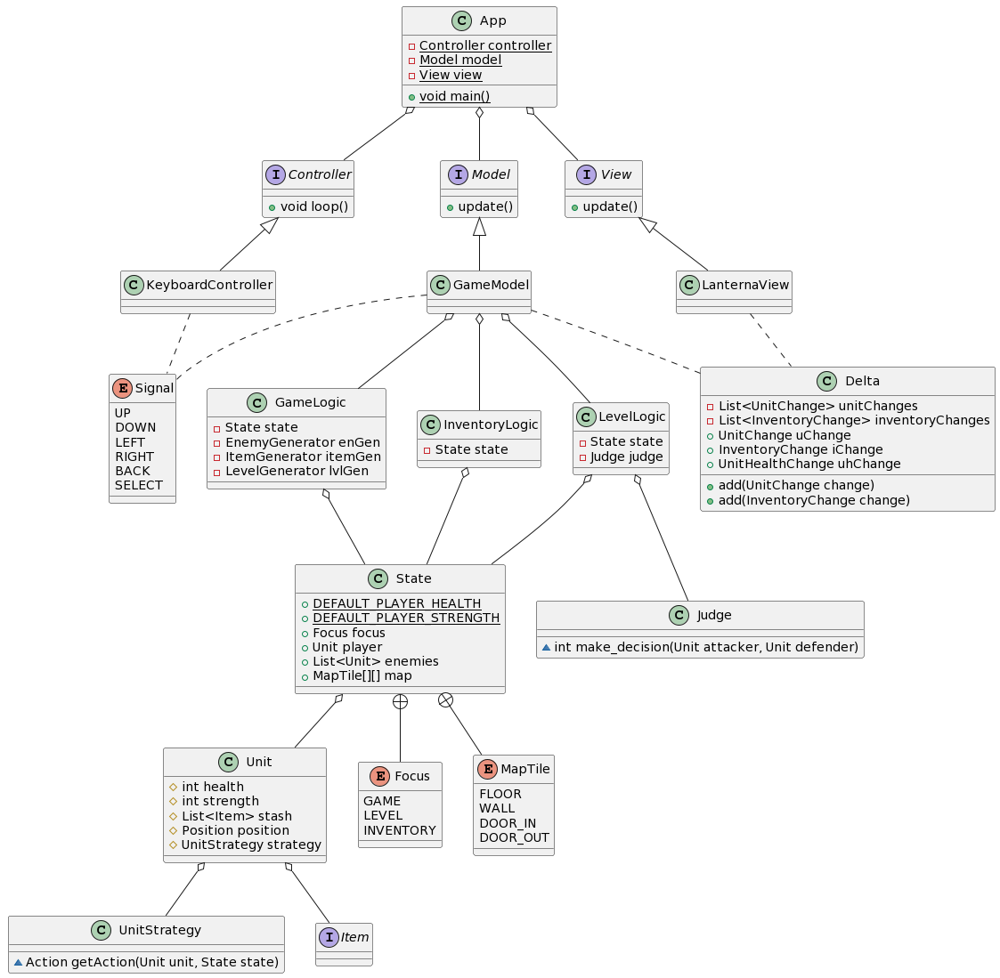
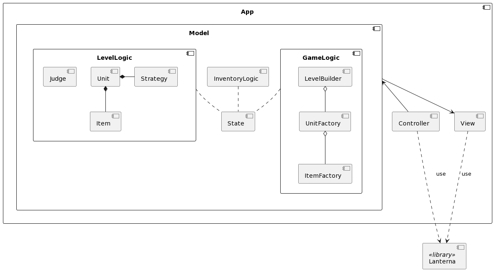

## Участники:
- Анеля Дусаева
- Артемий Лазарев
- Маргарита Лазарева
- Ильсияр Фаттахова

## Описание

Игрок находится только в одной комнате. Переход в следующую комнату осуществляется только после убийства всех врагов в текущей комнате. Вернуться в следующую комнату нельзя. Из одной комнаты может быть несколько выходов в другие комнаты, игрок может выбрать, в какую пойти. Одно перемещение игрока сопровождается одним перемещением монстров в комнате.

Предметы появляются только из мёртвых врагов. Предметы хранятся в инвентаре у игрока. После смерти врага игрок может выбрать, что из имеющегося инвентарят врага он возьмёт себе.

При сражениях исход сражения определяет сущность судьи. Сражение происходит лишь в случае нахождения игрока и врага в определённом радиусе. После того, как игрок был ранен, он может восстановить здоровье посредством аптечки (при наличии). Враг не может восстанавливать здоровье. 

Фокус игрока может переключаться с игрового поля на инвентарь. В зависимости от того, на чём сейчас находится фокус, состояние игры меняется по-разному: для игрового поля изменение состояния --- это результат передвижений и сражений, для инвентаря --- выбор предмета, который в данный момент находится на игроке.

Игра заканчивается, когда у игрока не остаётся здоровья.

## Основные сущности

Выбранная архитектурная модель --- MVC.

### Model

1. `Logic`: внутренняя логика игры
    - `GameLogic`: Отвечает за генерацию новых комнат (`LevelBuilder`), наполнение их противниками (`UnitFactory`) 
                   и наполение карманов противников вещами для собирания (`ItemFactory`)
    - `InventoryLogic`: сохранение текущего состояния инвентаря, выбранного предмет в инвентаре, подбирание предметов
    - `LevelLogic`: Обработка движений игрока, движение юнитов (обращение к их стратегиям)

1. `State`: хранение текущего состояние игры (характеристик игрока и врагов, если фокус находится на игровом поле, и предметов инвентаря, если фокус находится на инвентаре)

1. `Generators`
    - `ItemFactory`: фабрика для предметов, которые помещаются в инветарь игрока/врагов/в сундуки
    - `UnitFactory`: фабрика для юнитов (противников, сундуков и игрока)
    - `LevelBuilder`: строитель для уровня, 

1. `Unit`: интерфейс для противников и игрока.
   * `MaxHealth`: константное значение здоровья, может быть увеличено или уменьшено в процессе игры 
   * `Health`: текущий ровень здоровья
   * `Strength`: значение урона, наносимого врагам
   * `Strategy`: поведение юнита
     * `PlayerProxyStrategy`: для игрока поведение определяется вводом с клавиатуры, поэтмоу его стратегия
        проксирует действия вызванные нажатиями клавиш
     * Для противников стратегия выдаётся `UnitFactory` и определяет агрессивность и скорость противника
     * Для сундука стратегия `IdleStrategy` не генерирует одно действие - стоять на месте
   * `Position`: Позиция юнита на карте

1. `Item`: предметы, получаемые игроком
    - Одноразовые
      * Аптечка: восстановление здоровья на константу
      * Перемещение: перемещение на другую клетку в рамках комнаты
      * Бомба: нанесение урона соперникам, которые находятся в определённом радиусе
    - Многоразовые
      * Броня: увеличивает максимальное возможное здоровье
      * Меч: увеличивает максимыльный наносимый урон

1. `Judge`: Получает на вход действие юнита, если оно валидно применяет его (перемещает юнит),
            если перемещение приводит к бою, разрешает результат боя.

### View 

1. `View`: отрисовка текущего состояния игры
   - `LanternaView`: Отрписовка в консоли

### Controller

1.  `Signal`: (enum) полученные сигналы с клавиатуры
2.  `Controller`
    - `KeyboardController`: Обработка нажатых клавиш и оповещение модели 

## Диаграмма классов

## Диаграма компонентов

