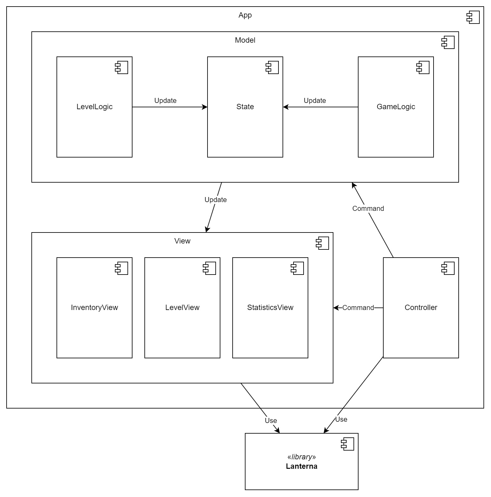

## Участники:
- Анеля Дусаева
- Артемий Лазарев
- Маргарита Лазарева
- Ильсияр Фаттахова

## Описание

Игрок находится только в одной комнате. Переход в следующую комнату осуществляется только после убийства всех врагов в текущей комнате. Вернуться в следующую комнату нельзя. Из одной комнаты может быть несколько выходов в другие комнаты, игрок может выбрать, в какую пойти. Одно перемещение игрока сопровождается одним перемещением монстров в комнате.

Предметы хранятся в инвентаре у любого юнита (игрока или противника). После смерти врага игрок может выбрать, что из имеющегося инвентарят врага он возьмёт себе.

Фокус игрока может переключаться с игрового поля на инвентарь. В зависимости от того, на чём сейчас находится фокус, состояние игры меняется по-разному: для игрового поля изменение состояния --- это результат передвижений и сражений, для инвентаря --- выбор предмета, который в данный момент находится на игроке.

Игра заканчивается, когда у игрока не остаётся здоровья.

## Управление и отображение
`@` - игрок, стены - белые, пол - чёрный. Выходы отмечены как клетки зелёного(обычная), красного (сложная комната) и жёлтого (сокровищница) цветов.
Цвет юнита указывает на его здоровье. Юниты также обладают различными иконками когда они живы и нет.

`ESC` - переключение фокуса между картой и инвентарём
 * Инвентарь
   * Стрелки вверх-вниз меняют выбранный предмет
   * `Enter` - применяет выбранный предмет
   * Применение `Poison`, которое всегда есть при игроке, убивает игрока и заканчивает игру
 * Карта
   * Стрелки двигают игрока по карте
   * Движение на живого противника спровоцирует атаку (но перемещения не произойдёт)
   * Движение на мёртвого противника добавит все его предметы в инвентарь

## Основные сущности

Выбранная архитектурная модель --- MVC.

### Model

1. `Logic`: внутренняя логика игры
    - `GameLogic`: Отвечает за генерацию новых комнат (`LevelBuilder`), наполнение их противниками (`UnitFactory`) и наполение карманов противников вещами для собирания (`ItemFactory`)
    - `LevelLogic`: Обработка движений игрока, движение юнитов (обращение к их стратегиям)

1. `State`: хранение текущего состояние игры (характеристик игрока и врагов, карты, статистики игрока)

1. `Generators`
    - `ItemFactory`: фабрика для предметов, которые помещаются в инветарь игрока/врагов/в сундуки
    - `UnitFactory`: фабрика для юнитов (противников, сундуков и игрока)
    - `LevelBuilder`: строитель для уровня, 

1. `Unit`: интерфейс для противников и игрока.
   * `MaxHealth`: константное значение здоровья, может быть увеличено или уменьшено в процессе игры 
   * `Health`: текущий ровень здоровья
   * `Strength`: значение урона, наносимого врагам
   * `Strategy`: поведение юнита
     * `PlayerProxyStrategy`: для игрока поведение определяется вводом с клавиатуры, поэтмоу его стратегия
        проксирует действия вызванные нажатиями клавиш
     * Для противников стратегия выдаётся `UnitFactory` и определяет поведение противника
     * Для сундука стратегия `IdleStrategy`, генерирует одно действие - ничего не делать
   * `Position`: Позиция юнита на карте

1. `Item`: предметы, получаемые игроком
   * Health Potion: восстановление здоровья на константу
   * Bomb: нанесение урона всем юнитам на карте
   * Strength Potion: постоянное увеличение силы
   * Confusion Spell: заклинание сметения, заставляет случайного юнита совершать случаные действия

### View 

1. `View`: отрисовка текущего состояния игры
   - `LanternaView`: Отрписовка в консоли
   - `InventoryView`: Отрисовка Инвентаря
   - `LevelView`: Отрисовка уровня (карта и враги)
   - `StatisticsView`: Отрисовка статистика (здоровье, сила, опыт игрока)

### Controller

1.  `Controller`
    - `KeyboardController`: Обработка нажатых клавиш и оповещение модели, иногда обновление View

## Диаграмма классов
Диаграмма актуальна для частей 1-2

## Диаграма компонентов
Диаграмма актуальна для частей 3-4

 * **Model** - модель
   * **State** - состояние, хранит инфорамцию о карте, игроке и противниках
   * **LevelLogic** - компонент отвечающий за обновление состояния во время обычных ходов и применения предметов, основная работа в этом компоненте - принятие решений юнитов (опрос их стратегий, Strategy), а затем их применение этих решений (StateUpdate)
   * **GameLogic** - компонент отвечающий за обновление состояния вне обычных ходов (генерация начальной карты, генерация новых комнат при переходе) к этому подулю принадлежат MapBuilder, (I)UnitFactory, ItemFactory
   * Этот компонент изолирован от GUI (lanterna), взаимодействует с View путём посыла копии состояния
 * **View** - отображение
   * **InventoryView** - отображение инвентаря
   * **LevelView** - отображение уровня (карты и врагов)
   * **StatisticsView** - отображение статистики
   * View полагается на библиотеку lanterna для рисования в консоли
 * **Controller** - контроллер
   * Пологается на библиотеку lanterna для определение нажатий клавиш
